```{r, echo = FALSE}
library(knitr);
opts_chunk$set(echo = FALSE);
```


## Why people do science, particularly biology


```{r, out.width = "100%", echo = FALSE, fig.cap = ""}
;
```

\footnotetext[1]{Image: Gillette, B. 1972. \href{https://commons.wikimedia.org/wiki/File:GIRL_USES_A_MAGNIFYING_GLASS_TO_STUDY_PLANT_LIFE_IN_THE_TUNDRA_OF_THE_ROCKY_MOUNTAINS._THE_DENVER_PTA_SPONSORED_A..._-_NARA_-_543740.jpg}{Public Domain}}


## Unification of celestial and terrestrial motion

```{r, out.width = "100%", echo = FALSE, fig.cap = ""}
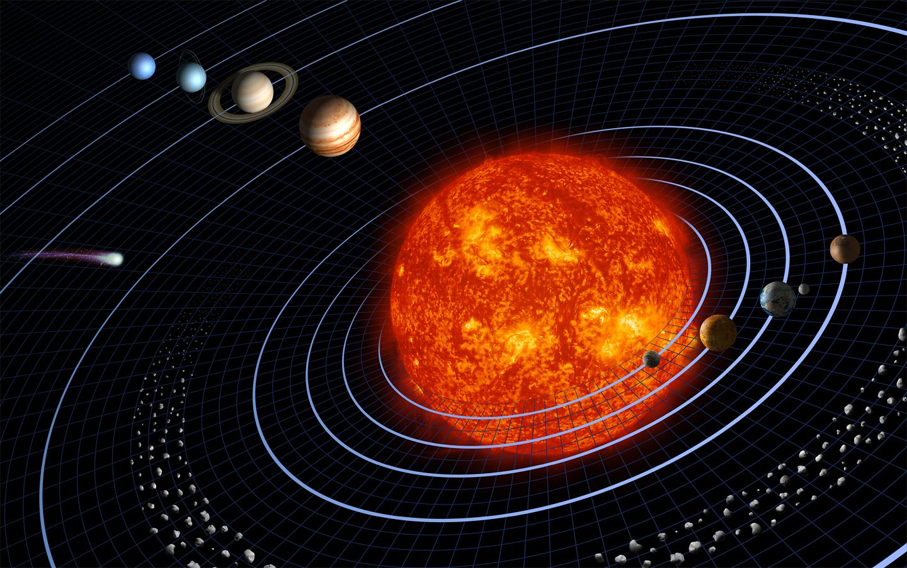;
```

\footnotetext[1]{Image: Smith, H and L Generosa (2006). \href{https://commons.wikimedia.org/wiki/File:Solar_sys8.jpg}{Public Domain}}


## Complexity of the biological sciences


```{r, out.width = "90%", echo = FALSE, fig.cap = ""}
include_graphics("img/bee.jpg");
```


\footnotetext[1]{Image: John Severns (2006). \href{https://commons.wikimedia.org/wiki/File:European_honey_bee_extracts_nectar.jpg}{Public Domain}}


## Complexity of the biological sciences

```{r, out.width = "90%", echo = FALSE, fig.cap = ""}
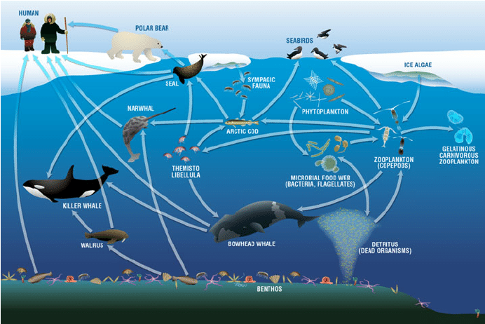;
```


\footnotetext[1]{Darnis, G, et al. (2012). Current state and trends in Canadian Arctic marine ecosystems: II. Heterotrophic food web, pelagic-benthic coupling, and biodiversity. Climatic Change, 115, 179-205.}
\footnotetext[1]{Image: Darnis, G, et al. (2012). \href{https://commons.wikimedia.org/wiki/File:Arctic_Marine_Food_Web.png}{Public Domain}}


## Unification of evolution and genetics

\begin{columns}
\begin{column}{0.5\textwidth}
\begin{center}
\textbf{Darwinian evolution}
\end{center}


```{r, out.width = "100%", echo = FALSE, fig.cap = ""}
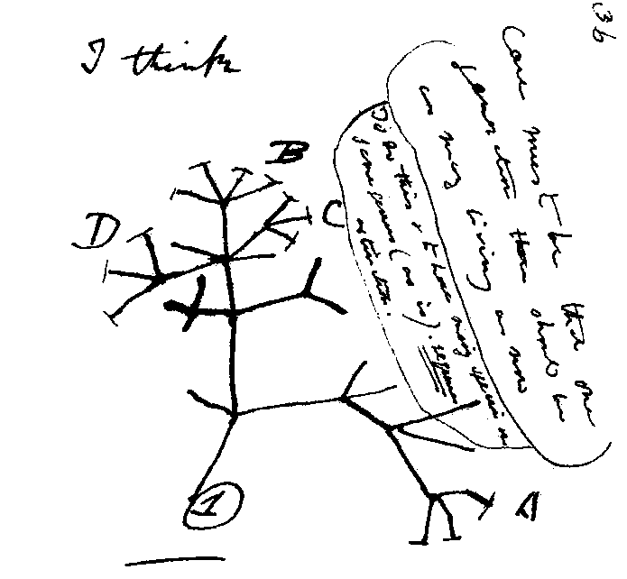;
```

   
\end{column}
\begin{column}{0.5\textwidth}  
\begin{center}
\textbf{Mendelian genetics}
\end{center}

```{r, out.width = "100%", echo = FALSE, fig.cap = ""}
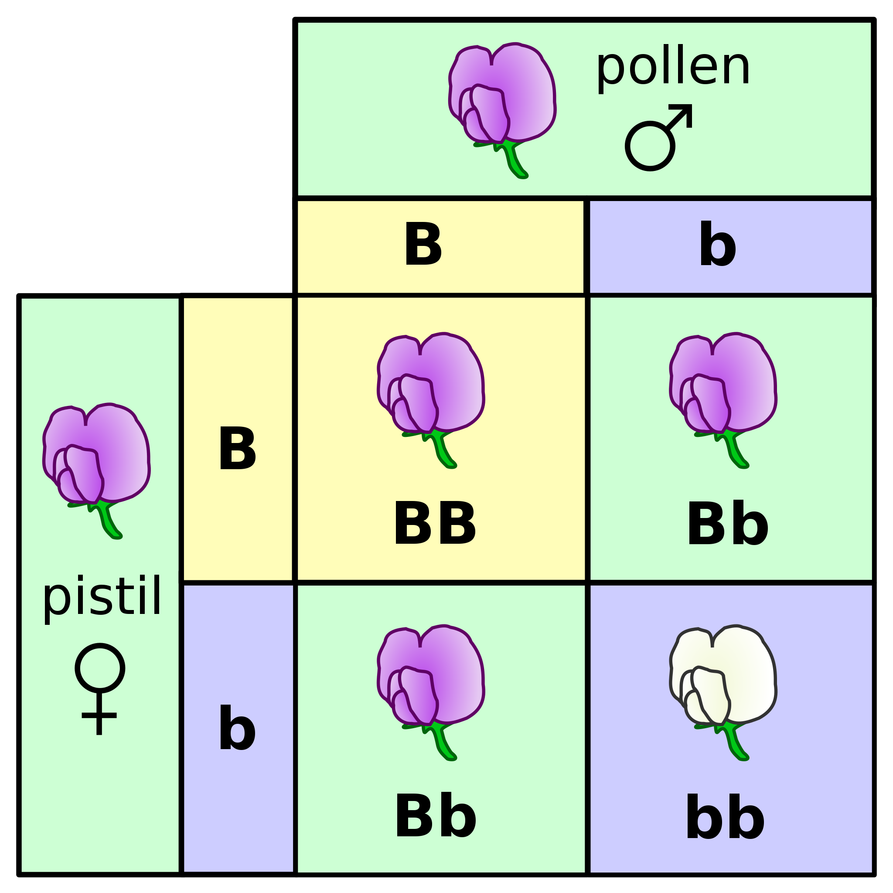;
```


\end{column}
\end{columns}


\footnotetext[1]{Image (left): \href{https://commons.wikimedia.org/wiki/File:Darwin_tree.png}{Public Domain}}
\footnotetext[2]{Image (right): Madeleine Price Ball (2007).  \href{https://commons.wikimedia.org/wiki/File:Punnett_square_mendel_flowers.svg}{Public Domain}}


## Unification of evolution and genetics

\Huge

$$p^{2} + 2pq + q^{2} = 1$$
\vspace{0.5mm}
\hrule
\vspace{1mm}

\Large

\begin{itemize}
\item No natural selection
\item No mutation
\item No migration (no gene flow)
\item Infinite population size
\item Mating is random
\item Non-overlapping generations
\end{itemize}


## General theory of community ecology

\LARGE

\begin{columns}
\begin{column}{0.5\textwidth}
\begin{center}
\textbf{Population genetics}
\vspace{2mm}
\hrule
\vspace{2mm}
\end{center}

\begin{itemize}
\item Selection
\item Mutation
\item Gene flow
\item Genetic drift
\end{itemize}


\end{column}
\begin{column}{0.5\textwidth}  
\begin{center}
\textbf{Community ecology}
\vspace{2mm}
\hrule
\vspace{2mm}
\end{center}

\begin{itemize}
\item Species selection
\item Disperal
\item Drift
\item Speciation
\end{itemize}

\end{column}
\end{columns}
\vspace{3mm}
\hrule


General community ecology theory focused on high-level processes$^{1}$


\footnotetext[1]{Vellend, M (2016). The theory of ecological communities. Monographs in population biology. Princeton University Press.}


## Eco-evolutionary models


```{r, out.width = "100%", echo = FALSE, fig.cap = ""}
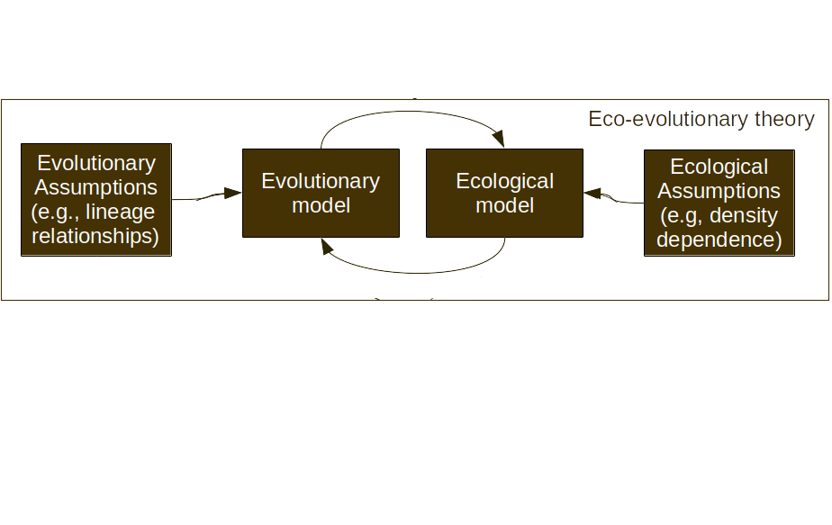;
```


## Eco-evolutionary models

\Large

\begin{columns}
\begin{column}{0.5\textwidth}

Lion$^{1}$ (2018)
\hrule

\vspace{2mm}

\textbf{Ecology:}
    
$$\frac{dn_{i}}{dt} = r_{i}\left(\mathbf{E}\right)n_{i}$$
   
\vspace{4mm}
\textbf{Evolution:}   
   
$$\frac{df_{i}}{dt} = f_{i}\left(r_{i} \left(\mathbf{E} \right) - \bar{r} \left(\mathbf{E} \right) \right)$$   
   

   
   
\end{column}
\begin{column}{0.5\textwidth}  

\pause

Patel et al.$^{2}$ (2018)
\hrule

\vspace{2mm}

\textbf{Ecology:}

$$\frac{dN_{i}}{dt} = N_{i}f_{i}\left(N, x\right)$$

\vspace{2mm}
\textbf{Evolution:}

$$\frac{dx_{j}}{dt} = \epsilon g_{j}\left(N, x\right)$$


\end{column}
\end{columns}


\footnotetext[1]{Lion, S (2018). Theoretical approaches in evolutionary ecology: environmental feedback as a unifying perspective. Am. Nat., 191:21-44}
\footnotetext[2]{Patel, S, Cortez, MH, \& Schreiber, SJ (2018). Partitioning the effects of eco-evolutionary feedbacks on community stability. The Am. Nat., 191:381-394.}


## Conceptual unification of ecology and evolution


```{r, out.width = "100%", echo = FALSE, fig.cap = ""}
;
```


## Conceptual unification of ecology and evolution


```{r, out.width = "100%", echo = FALSE, fig.cap = ""}
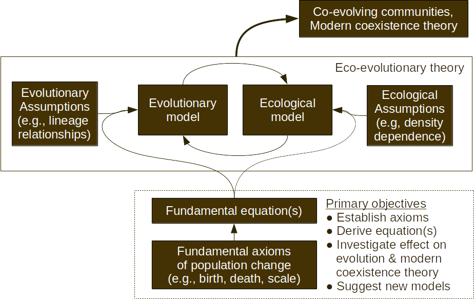;
```


## Unification of modern coexistence theory \& Price equation


Joint funding call between French Foundation for Research on Biodiversity and German Centre for Integrative Biodiversity Research (iDiv): CESAB-sDIV SYNERGY


```{r, out.width = "100%", echo = FALSE, fig.cap = ""}
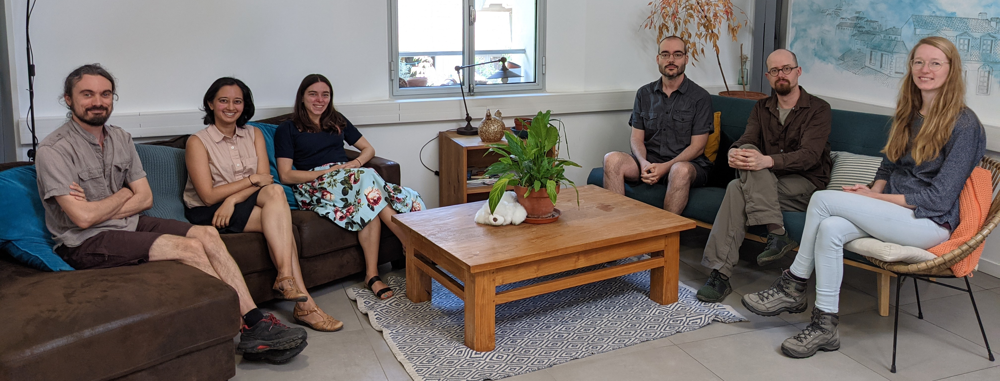;
```


The UNICOP team in Montpellier (summer 2023)


## A different role of theory (not doing modelling)

\LARGE

- Not making assumptions or predictions \pause
- Defining population change in an eco-evo context \pause
- Framework for models (meta-modelling) \pause
- A rough analogy,


$$y = \beta_{0} + \beta_{1}x$$

\pause\vspace{5mm}

- Or Newton's second law, $F = ma$ 


## Newtonian mechanics as a theory net


```{r, out.width = "110%", echo = FALSE, fig.cap = ""}
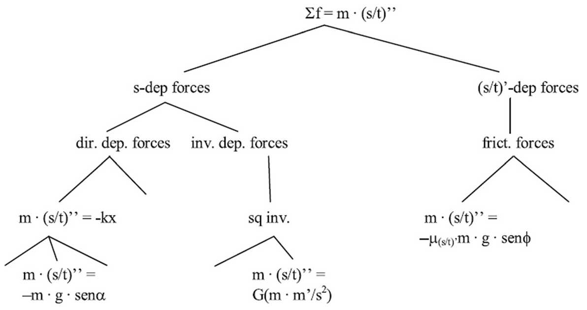;
```

\footnotetext[1]{Luque, VJ, \& L Baravalle (2021). The mirror of physics: on how the Price equation can unify evolutionary biology. Synthese, 0123456789.}


## The fundamental equation of evolution

\Huge

$$\bar{w}\Delta\bar{z} = Cov\left(w, z\right) + E\left(w\Delta z\right)$$

\footnotetext[1]{Price, GR (1970). Selection and covariance. Nature 227:520–521.}
\footnotetext[2]{Luque, VJ (2017). One equation to rule them all: a philosophical analysis of the Price equation. Biology and Philosophy, 32:1–29.}
\footnotetext[3]{Lehtonen, J, Okasha, S, \& Helanterä, H (2020). Fifty years of the Price equation. Philosophical Transactions of the Royal Society B: Biological Sciences, 375:20190350.}
\footnotetext[4]{Frank, SA (2012). Natural selection. IV. The Price equation. Journal of Evolutionary Biology, 25, 1002–1019.}
\footnotetext[5]{Lion, S (2018). From the Price equation to the selection gradient in class-structured populations: a quasi-equilibrium route. Journal of Theoretical Biology, 447, 178–189.}

## The fundamental equation of evolution

```{r, out.width = "110%", echo = FALSE, fig.cap = ""}
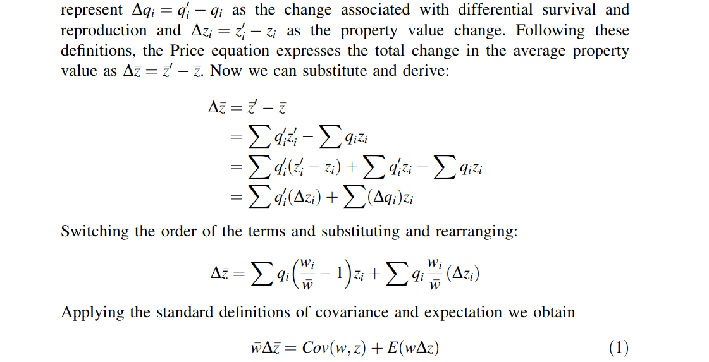;
```

\footnotetext[1]{Luque, VJ (2017). One equation to rule them all: a philosophical analysis of the Price equation. Biology and Philosophy, 32:1–29.}

## The fundamental equation of evolution


```{r, out.width = "110%", echo = FALSE, fig.cap = ""}
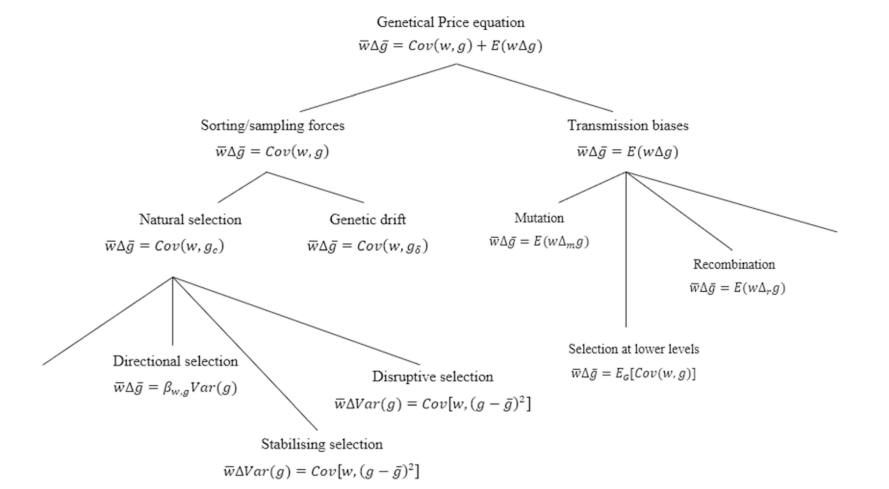;
```

\footnotetext[1]{Luque, VJ, \& L Baravalle (2021). The mirror of physics: on how the Price equation can unify evolutionary biology. Synthese, 0123456789.}


## Recursive properties of the Price equation

\Huge

$$\bar{w}\Delta\bar{z} = Cov\left(w, z\right) + E\left(w\Delta z\right)$$

\footnotetext[1]{Price, GR (1970). Selection and covariance. Nature 227:520–521.}
\footnotetext[2]{Kerr, B, \& P Godfrey-Smith (2009). Generalization of the price equation for evolutionary change. Evolution, 63:531–536.}
\footnotetext[3]{Frank, SA (2012). Natural selection. IV. The Price equation. Journal of Evolutionary Biology, 25, 1002–1019.}


## Derive other fundamental equations

```{r, out.width = "90%", echo = FALSE, fig.cap = ""}
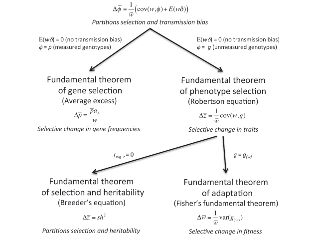;
```


\footnotetext[1]{Queller, DC (2017). Fundamental theorems of evolution. The American Naturalist, 189:345-353.}


## Generality of the Price equation

\Large

**Evolution of non-biological systems**

- Archaeological artefacts$^{1}$
- Musical properties$^{2}$

\pause

**Synthesis across disciplines**

- D'Alembert's principle of mechanics$^{3}$
- Information theory$^{4}$

\footnotetext[1]{Brantingham, PJ (2007). A unified evolutionary model of archaeological style and function based on the Price equation. American Antiquity 72:395–416.}
\footnotetext[2]{MacCallum, RM, et al. (2012). Evolution of music by public choice. PNAS 109:12081–12086.}
\footnotetext[3]{Frank, SA (2015). D'Alembert’s direct and inertial forces acting on populations: The price equation and the fundamental theorem of natural selection. Entropy 17:7087–7100.}
\footnotetext[3]{Frank, SA (2012). Natural selection. V. How to read the fundamental equations of evolutionary change in terms of information theory. Journal of Evolutionary Biology, 25:2377-2396.}


## Conceptual unification of ecology and Price equation


```{r, out.width = "100%", echo = FALSE, fig.cap = ""}
;
```


## Links between ecology and the Price equation

**Ecosystem function loss due to species loss$^{1}$**

\Large

$$\Delta T = \bar{z}\Delta s + Sp(w, z) + \sum_{i}w_{i}\Delta z_{i}$$

\normalsize\pause

**Community trait change: Physiology, evolution, ecology$^{2}$** 

\Large

$$\Delta \bar{z} = E_{I}\left(E_{Ji} \left(\Delta z_{ij} \right) \right) + E_{I}\left(cov_{Ji} \left(w_{ij}, z'_{ij} \right) \right) + cov_{I}\left(w_{i}, z'_{i}\right)$$


\footnotetext[1]{Fox, JW (2006). Using the price equation to partition the effects of biodiversity loss on ecosystem function. Ecology, 87(11), 2687-2696.}
\footnotetext[2]{Collins, S \& Gardner, A (2009). Integrating physiological, ecological and evolutionary change: A Price equation approach. Ecology Letters, 12(8), 744-757.}


## Links between ecology and the Price equation


```{r, out.width = "100%", echo = FALSE, fig.cap = ""}
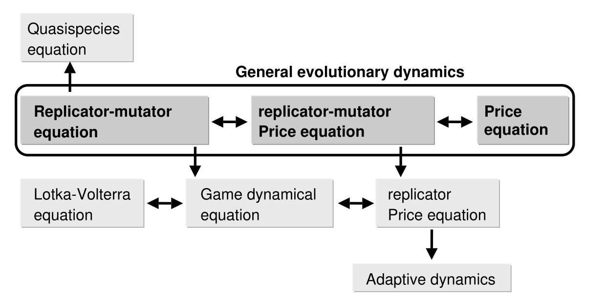;
```


\LARGE

- Figure 1 from Page \& Nowak$^{1}$
- Relies on \textit{relative} species frequenies


\footnotetext[1]{Page, KM \& Nowak, MA (2002). Unifying evolutionary dynamics. Journal of Theoretical Biology, 219(1), 93–98.}

## Reconciling evolutionary change and population growth {.t}

\Large

- Start with Price equation and add ecology?
- Start elsewhere and derive the Price equation?

```{r, out.width = "100%", echo = FALSE, fig.cap = ""}
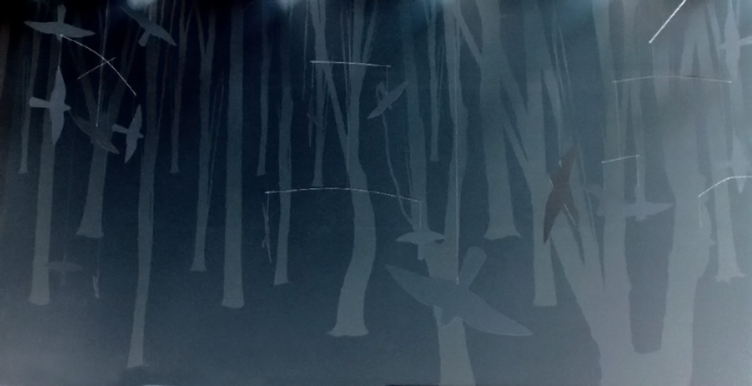;
```


\footnotetext[1]{Image: Eneas De Troya (2006).  \href{https://commons.wikimedia.org/wiki/File:Lost_in_a_Virtual_Wood_(177504871).jpg}{CC BY 2.0}}


## The fundamental equation of ecology

\Huge

- Evolution: Price Equation
- Ecology: Births and deaths

$$N_{t+1} = N_{t} + Births - Deaths$$

\footnotetext[1]{Gotelli, NJ (2001). A Primer of Ecology. Sinauer Associate. Inc. Sunderland, MA.}
\footnotetext[2]{Rockwood, LL (2006). Introduction to population ecology. Blacwell. Malden, MA}
\footnotetext[3]{Turchin, P (2001). Does population ecology have general laws? Oikos, 94(1), 17-26 \href{https://doi.org/10.1034/j.1600-0706.2001.11310.x}{[PDF]}}


## Finite rate of increase for a population {.t}

\Huge

$$N_{t+1} = N_{t}(1 + b - d)$$


$$\lambda = (1 + b - d)$$

$$N_{t+1} = N_{t}\lambda$$

## Finite rate of increase for a population

```{r, echo = FALSE, fig.height = 7, fig.width = 9}
BB    <- 1.05;
No    <- 100;
tt    <- 1:100;
NN    <- rep(x = NA, times = 100);
NN[1] <- No;
for(i in 2:100){
  NN[i] <- NN[i - 1] * BB;
}
par(mar = c(6, 6, 1, 1));
plot(x = 1:100, y = NN, type = "l", lwd = 6, xlab = "Time (t)", 
     ylab = "Population Size (N)",
     cex.axis = 1.5, cex.lab = 2.5, xaxt = "n", yaxt = "n")
```


## Reconciling foundations of evolution and ecology

\Huge

**Evolution:** Price Equation

\vspace{-10mm}

$$\bar{w}\Delta\bar{z} = Cov\left(w, z\right) + E\left(w\Delta z\right)$$

\hrule

\vspace{5mm}


**Ecology:** Exponential growth

\vspace{-10mm}

$$N_{t+1} = N_{t} + Births - Deaths$$


## The unifying equation

\LARGE

- No systematic approach
- Individual birth, death, characteristics
- Deductive exploration

\vspace{5mm}
\hrule
\pause
\vspace{5mm}

\Huge

As expected, the answer is obvious in hindsight.


## A fundamental equation for ecology and evolution {.t}


\LARGE

$$\Omega = \sum_{i=1}^{N} \left(\beta_{i} - \delta_{i} + 1 \right)\left(z_{i} + \Delta z_{i} \right)$$

\vspace{5mm}
\hrule

\pause
\LARGE

- $\Omega$: Some summed quantity
- $N$: Population size
- $i$: Individuals in population
- $\beta$: Births attributable to $i$
- $\delta$: Death indicator variable
- $z_{i}$: Character of $i$


## Ecology: Character species identity (z = 1), ($\Delta$z = 0) {.t}


\LARGE

$$\Omega = \sum_{i=1}^{N} \left(\beta_{i} - \delta_{i} + 1 \right)\left(z_{i} + \Delta z_{i} \right)$$

\vspace{5mm}
\hrule \pause

$$\Omega = \sum_{i=1}^{N} \left(\beta_{i} - \delta_{i} + 1 \right)$$

$$N_{t+1} = N_{t} + Births - Deaths$$ 


$$N_{t+1} = N_{t} \left(1 + \beta - \delta \right) = N_{t}\lambda$$


## Evolution: Character individual trait ($z_{i}$) {.t}


\LARGE

$$\Omega = \sum_{i=1}^{N} \left(\beta_{i} - \delta_{i} + 1 \right)\left(z_{i} + \Delta z_{i} \right)$$

\vspace{5mm}
\hrule \pause

Define fitness, $w_{i} = \beta_{i} - \delta_{i} + 1$. Substitute,

$$\Omega = \sum_{i=1}^{N} \left(w_{i}z_{i} + w_{i}\Delta z_{i} \right)$$


$$\frac{1}{N}\Omega = \frac{1}{N}\sum_{i=1}^{N} \left(w_{i}z_{i}\right) + \frac{1}{N}\sum_{i=1}^{N} \left(w_{i}\Delta z_{i} \right)$$


## Evolution: Character individual trait ($z_{i}$) {.t}


\LARGE

$$\frac{1}{N}\Omega = \frac{1}{N}\sum_{i=1}^{N} \left(w_{i}z_{i}\right) + \frac{1}{N}\sum_{i=1}^{N} \left(w_{i}\Delta z_{i} \right)$$

\vspace{5mm}
\hrule \pause

Rewrite as expected values,

$$\frac{1}{N}\Omega = E\left(wz\right) + E\left(w\Delta z \right).$$


## Evolution: Character individual trait ($z_{i}$) {.t}


\LARGE

$$\frac{1}{N}\Omega = E\left(wz\right) + E\left(w\Delta z \right).$$

\vspace{5mm}
\hrule \pause

Tricky step is to note $\Omega = N\bar{w}\bar{z}'$ because we need to conserve total probability$^{1,2}$, so,

$$\bar{w}\bar{z}' = E\left(wz\right) + E\left(w\Delta z \right).$$


\footnotetext[1]{Frank, Steven A (2015) "D'Alembert's direct and inertial forces acting on populations: The Price equation and the fundamental theorem of natural selection." Entropy 17: 7087–7100.}
\footnotetext[2]{Frank, Steven A (2016) "Common probability patterns arise from simple invariances." Entropy 18 (5): 1–22.}


## Evolution: Character individual trait ($z_{i}$) {.t}


\LARGE

$$\bar{w}\bar{z}' = E\left(wz\right) + E\left(w\Delta z \right).$$

\vspace{5mm}
\hrule \pause

Since $COV(X, Y) = E(XY) - E(X)E(Y)$,

$$\bar{w}\bar{z}' = Cov(w, z) + \bar{w}\bar{z} + E\left(w\Delta z \right).$$

$$\bar{w}\left(\bar{z}' - \bar{z}\right) = Cov(w, z) + E\left(w\Delta z \right).$$

## Evolution: Character individual trait ($z_{i}$) {.t}


\LARGE

$$\bar{w}\left(\bar{z}' - \bar{z}\right) = Cov(w, z) + E\left(w\Delta z \right).$$

\vspace{5mm}
\hrule \pause

Since $\Delta z = \bar{z}' - \bar{z}$,

$$\bar{w}\Delta\bar{z} = Cov(w, z) + E\left(w\Delta z \right).$$

We have therefore derived Price.


## A formal definition of eco-evolutionary change {.t}

\LARGE

$$\Omega = \sum_{i=1}^{N} \left(\beta_{i} - \delta_{i} + 1 \right)\left(z_{i} + \Delta z_{i} \right)$$

\vspace{5mm}
\hrule 

Formalises ecology \& evolution \pause

- No simplifying assumptions \pause
- Complete and exact (closed populations) \pause
- Ecology: $\beta_{i} - \delta_{i} + 1$ \pause
- Evolution: $z_{i} + \Delta z_{i}$ \pause
- Ecology required for selection or drift


## Confirmations from a formal definition {.t}

\LARGE

$$\Omega = \sum_{i=1}^{N} \left(\beta_{i} - \delta_{i} + 1 \right)\left(z_{i} + \Delta z_{i} \right)$$

\vspace{5mm}
\hrule 

Formalises fitness and population growth: \pause

- **Fitness:** $\bar{w} = \lambda = \beta - \delta + 1$ \pause
- Derives assumed $N_{t+1} = N_{t}\lambda = N_{t}\bar{w}$ \pause
- Lifetime fitness is still $\beta_{i}$ \pause
- Starting point for further unification \pause
- Build upon for community ecology

## An elegance in two fits {.t}

\LARGE

$$\Omega = \sum_{i=1}^{N} \left(\beta_{i} - \delta_{i} + 1 \right)\left(z_{i} + \Delta z_{i} \right)$$

\vspace{2mm}
\hrule 

Fisher's fundamental theorem$^{1,2}$ $w = z$, \pause

$$\Delta \bar{w} = \frac{1}{\bar{w}}Var(w)$$

This is because $Cov(w, w) = Var(w)$.


\footnotetext[1]{Frank, SA (1997). "The Price equation, Fisher’s fundamental theorem, kin selection, and causal analysis." Evolution 51:1712–29.}
\footnotetext[1]{Queller, DC (2017). Fundamental theorems of evolution. The American Naturalist, 189:345-353.}


## An elegance in two fits {.t}

\LARGE

$$\Omega = \sum_{i=1}^{N} \left(\beta_{i} - \delta_{i} + 1 \right)\left(z_{i} + \Delta z_{i} \right)$$

\vspace{5mm}
\hrule 

**What this means is the following:** \pause

- Rate of population growth is the first statistical moment of fitness  \pause
- Rate of adaptive evolution is the second statistical moment of fitness


## Bonus for ecosystem function {.t}

\LARGE

$$\Omega = \sum_{i=1}^{N} \left(\beta_{i} - \delta_{i} + 1 \right)\left(z_{i} + \Delta z_{i} \right)$$

\vspace{5mm}
\hrule

We can define z as a trait (e.g., photosynthetic rate, decomposition rate, biomass) and recover $\Omega$ as a population's contribution to ecosystem function.


## Foundations of ecological and evolutionary change {.t}

\LARGE

$$\Omega = \sum_{i=1}^{N} \left(\beta_{i} - \delta_{i} + 1 \right)\left(z_{i} + \Delta z_{i} \right)$$

\vspace{5mm}
\hrule


```{r, out.width = "100%", echo = FALSE, fig.cap = ""}
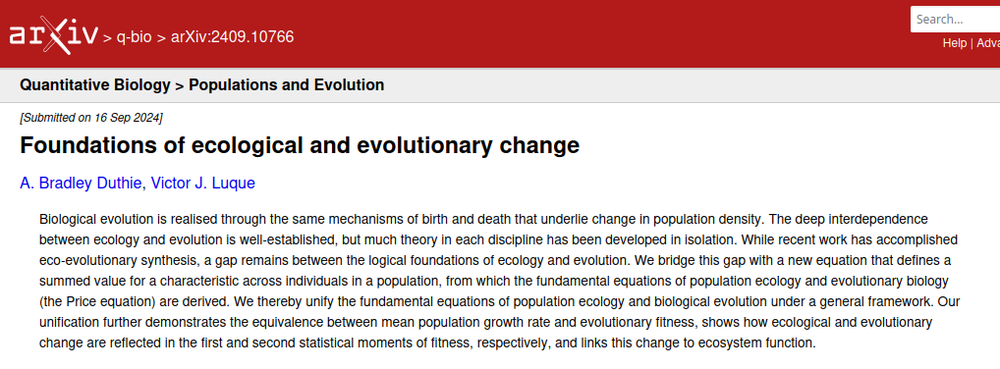;
```


\footnotetext[1]{Duthie, AB, \& Luque, VJ (2024). Foundations of ecological and evolutionary change. arXiv preprint arXiv:2409.10766.}

