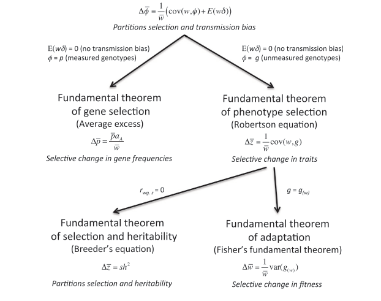

```{r, echo = FALSE}
library(knitr);
opts_chunk$set(echo = FALSE);
```


## BES Tuesday seminars this autumn

\Large

**TEG: LT W1 from 13:00-14:00** (until 26 NOV)

\large

\vspace{5mm}

| Date    |  Speaker           | | Date    | Speaker            |
|---------|--------------------|-|---------|--------------------|
| 24 SEP  | Heather Anderson   | | 05 NOV  | Reuben Nowell      |
| 01 OCT  | **Open**           | | 12 NOV  | Ruth Wright        |
| 08 OCT  | Matt Tinsley       | | 19 NOV  | Zarah Pattison     |
| 15 OCT  | Carmen Carmona     | | 26 NOV  | Kirsty Park        |
| 22 OCT  | Mahtab Yaghouti    | | 03 DEC  | Emily Waddell      |
| 29 OCT  | Ponsarut Boonchuay | | 10 DEC  | Colin Bull         |


## Why people do science, particularly biology


```{r, out.width = "100%", echo = FALSE, fig.cap = ""}
;
```

\footnotetext[1]{Image: Gillette, B. 1972. \href{https://commons.wikimedia.org/wiki/File:GIRL_USES_A_MAGNIFYING_GLASS_TO_STUDY_PLANT_LIFE_IN_THE_TUNDRA_OF_THE_ROCKY_MOUNTAINS._THE_DENVER_PTA_SPONSORED_A..._-_NARA_-_543740.jpg}{Public Domain}}


## Unification of celestial and terrestrial motion

```{r, out.width = "100%", echo = FALSE, fig.cap = ""}
include_graphics("img/solar.jpg");
```

\footnotetext[1]{Image: Smith, H and L Generosa (2006). \href{https://commons.wikimedia.org/wiki/File:Solar_sys8.jpg}{Public Domain}}


## Big questions in biology

```{r, out.width = "100%", echo = FALSE, fig.cap = ""}
;
```


## Big questions in biology

```{r, out.width = "100%", echo = FALSE, fig.cap = ""}
;
```


## Call for proposals: joint sDiv-CESAB


```{r, out.width = "100%", echo = FALSE, fig.cap = ""}
;
```


## Call for proposals: joint sDiv-CESAB


```{r, out.width = "100%", echo = FALSE, fig.cap = ""}
include_graphics("img/fig1.png");
```


## The UNICOP project


\Huge

Conceptual unification of modern coexistence theory and the Price equation


## A different role of theory (not doing modelling)

\LARGE

- Framework for making models (meta-modelling) \pause
- Not making assumptions or predictions \pause
- Not the kind of thing we test, e.g., 

$$y_{i} = \beta_{0} + \beta_{1}x_{i} + \epsilon_{i}$$

\pause\vspace{5mm}

- Or Newton's second law, $F = ma$ 


## Newtonian mechanics as a theory net


```{r, out.width = "110%", echo = FALSE, fig.cap = ""}
include_graphics("img/physics.png");
```

\footnotetext[1]{Luque, VJ, \& L Baravalle (2021). The mirror of physics: on how the Price equation can unify evolutionary biology. Synthese, 0123456789.}


## The fundamental equation of evolution

\Huge

$$\bar{w}\Delta\bar{z} = Cov\left(w, z\right) + E\left(w\Delta z\right)$$

\footnotetext[1]{Price, GR (1970). Selection and covariance. Nature 227:520–521.}
\footnotetext[2]{Luque, VJ (2017). One equation to rule them all: a philosophical analysis of the Price equation. Biology and Philosophy, 32:1–29.}
\footnotetext[3]{Lehtonen, J, Okasha, S, \& Helanterä, H (2020). Fifty years of the Price equation. Philosophical Transactions of the Royal Society B: Biological Sciences, 375:20190350.}
\footnotetext[4]{Frank, SA (2012). Natural selection. IV. The Price equation. Journal of Evolutionary Biology, 25, 1002–1019.}
\footnotetext[5]{Lion, S (2018). From the Price equation to the selection gradient in class-structured populations: a quasi-equilibrium route. Journal of Theoretical Biology, 447, 178–189.}

## The fundamental equation of evolution

```{r, out.width = "110%", echo = FALSE, fig.cap = ""}
include_graphics("img/derivation.png");
```

\footnotetext[1]{Luque, VJ (2017). One equation to rule them all: a philosophical analysis of the Price equation. Biology and Philosophy, 32:1–29.}

## The fundamental equation of evolution


```{r, out.width = "110%", echo = FALSE, fig.cap = ""}
include_graphics("img/synthesis.png");
```

\footnotetext[1]{Luque, VJ, \& L Baravalle (2021). The mirror of physics: on how the Price equation can unify evolutionary biology. Synthese, 0123456789.}


## Recursive properties of the Price equation

\Huge

$$\bar{w}\Delta\bar{z} = Cov\left(w, z\right) + E\left(w\Delta z\right)$$

\footnotetext[1]{Price, GR (1970). Selection and covariance. Nature 227:520–521.}
\footnotetext[2]{Kerr, B, \& P Godfrey-Smith (2009). Generalization of the price equation for evolutionary change. Evolution, 63:531–536.}
\footnotetext[3]{Frank, SA (2012). Natural selection. IV. The Price equation. Journal of Evolutionary Biology, 25, 1002–1019.}


## Derive other fundamental equations

```{r, out.width = "90%", echo = FALSE, fig.cap = ""}
;
```


\footnotetext[1]{Queller, D. C. (2017). Fundamental theorems of evolution. The American Naturalist, 189:345-353.}


## My goal: starting point is unclear

\LARGE

- Figure out how to unify the Price equation with ecological change \pause
- Start with the Price equation and add ecology? \pause
- Start somewhere else and derive Price? \pause
- Is this even possible? \pause
- If it's possible, it will look obvious in hindsight


## The UNICOP team

```{r, out.width = "100%", echo = FALSE, fig.cap = ""}
;
```


## Leipzig in September 2022

```{r, out.width = "100%", echo = FALSE, fig.cap = ""}
;
```


## Leipzig in September 2022

\Huge

- Confusion about the question
- Separated project aims
- An attempt at an answer: \pause

\Large

$$iN + \Delta\bar{z} = i\left(1 + \bar{w} - \bar{\delta} \right)N + \frac{1}{\bar{w}}Cov\left(z, w\right) + \frac{1}{\bar{w}} E\left(w\Delta z \right).$$

\pause

- "It's not *wrong*" - S$\'{e}$b \pause
- "Brad, that's cheating" -Th$\'{e}$o


## Montpellier in June 2023: Not much progress

```{r, out.width = "85%", echo = FALSE, fig.cap = ""}
;
```


## On the backburner until January 2024

```{r, out.width = "100%", echo = FALSE, fig.cap = ""}
;
```


## On the backburner until January 2024

```{r, out.width = "160%", echo = FALSE, fig.cap = ""}
;
```


## Working day and night back and forth

```{r, out.width = "100%", echo = FALSE, fig.cap = ""}
;
```


## Finally a way forward, and fundamental ecology

\Huge

- Evolution: Price Equation
- Ecology: Exponential growth

$$N_{t+1} = N_{t} + Births - Deaths$$

\footnotetext[1]{Gotelli, NJ (2001). A Primer of Ecology. Sinauer Associate. Inc. Sunderland, MA.}
\footnotetext[2]{Rockwood, LL (2006). Introduction to population ecology. Blacwell. Malden, MA}
\footnotetext[3]{Turchin, P (2001). Does population ecology have general laws? Oikos, 94(1), 17-26 \href{https://doi.org/10.1034/j.1600-0706.2001.11310.x}{[PDF]}}


## Finite rate of increase for a population {.t}

\Huge

$$N_{t+1} = N_{t}(1 + b - d)$$


$$\lambda = (1 + b - d)$$

$$N_{t+1} = N_{t}\lambda$$

## Finite rate of increase for a population

```{r, echo = FALSE, fig.height = 7, fig.width = 9}
BB    <- 1.05;
No    <- 100;
tt    <- 1:100;
NN    <- rep(x = NA, times = 100);
NN[1] <- No;
for(i in 2:100){
  NN[i] <- NN[i - 1] * BB;
}
par(mar = c(6, 6, 1, 1));
plot(x = 1:100, y = NN, type = "l", lwd = 6, xlab = "Time (t)", 
     ylab = "Population Size (N)",
     cex.axis = 1.5, cex.lab = 2.5, xaxt = "n", yaxt = "n")
```


## Finally a way forward, and fundamental ecology

\Huge

**Evolution:** Price Equation

\vspace{-10mm}

$$\bar{w}\Delta\bar{z} = Cov\left(w, z\right) + E\left(w\Delta z\right)$$

\hrule

\vspace{5mm}


**Ecology:** Exponential growth

\vspace{-10mm}

$$N_{t+1} = N_{t} + Births - Deaths$$


## Nearly there: the unicorn equation

\Huge

As expected, the answer is obvious in hindsight.


## A fundamental equation for ecology and evolution {.t}


\LARGE

$$\Omega = \sum_{i=1}^{N} \left(\beta_{i} - \delta_{i} + 1 \right)\left(z_{i} + \Delta z_{i} \right)$$

\vspace{5mm}
\hrule

\pause
\LARGE

- $\Omega$: Some summed quantity
- $N$: Population size
- $i$: Individuals in population
- $\beta$: Births attributable to $i$
- $\delta$: Death indicator variable
- $z_{i}$: Character of $i$


## Ecology: Character species identity (z = 1), ($\Delta$z = 0) {.t}


\LARGE

$$\Omega = \sum_{i=1}^{N} \left(\beta_{i} - \delta_{i} + 1 \right)\left(z_{i} + \Delta z_{i} \right)$$

\vspace{5mm}
\hrule \pause

$$\Omega = \sum_{i=1}^{N} \left(\beta_{i} - \delta_{i} + 1 \right)$$

$$N_{t+1} = N_{t} + Births - Deaths$$ 


$$N_{t+1} = N_{t} \left(1 + \beta - \delta \right) = N_{t}\lambda$$


## Evolution: Character individual trait ($z_{i}$) {.t}


\LARGE

$$\Omega = \sum_{i=1}^{N} \left(\beta_{i} - \delta_{i} + 1 \right)\left(z_{i} + \Delta z_{i} \right)$$

\vspace{5mm}
\hrule \pause

Define fitness, $w_{i} = \beta_{i} - \delta_{i} + 1$. Substitute,

$$\Omega = \sum_{i=1}^{N} \left(w_{i}z_{i} + w_{i}\Delta z_{i} \right)$$


$$\frac{1}{N}\Omega = \frac{1}{N}\sum_{i=1}^{N} \left(w_{i}z_{i}\right) + \frac{1}{N}\sum_{i=1}^{N} \left(w_{i}\Delta z_{i} \right)$$


## Evolution: Character individual trait ($z_{i}$) {.t}


\LARGE

$$\frac{1}{N}\Omega = \frac{1}{N}\sum_{i=1}^{N} \left(w_{i}z_{i}\right) + \frac{1}{N}\sum_{i=1}^{N} \left(w_{i}\Delta z_{i} \right)$$

\vspace{5mm}
\hrule \pause

Rewrite as expected values,

$$\frac{1}{N}\Omega = E\left(wz\right) + E\left(w\Delta z \right).$$


## Evolution: Character individual trait ($z_{i}$) {.t}


\LARGE

$$\frac{1}{N}\Omega = E\left(wz\right) + E\left(w\Delta z \right).$$

\vspace{5mm}
\hrule \pause

Tricky step is to note $\Omega = N\bar{w}\bar{z}'$ because we need to conserve total probability$^{1,2}$, so,

$$\bar{w}\bar{z}' = E\left(wz\right) + E\left(w\Delta z \right).$$


\footnotetext[1]{Frank, Steven A (2015) "D'Alembert's direct and inertial forces acting on populations: The Price equation and the fundamental theorem of natural selection." Entropy 17: 7087–7100.}
\footnotetext[2]{Frank, Steven A (2016) "Common probability patterns arise from simple invariances." Entropy 18 (5): 1–22.}


## Evolution: Character individual trait ($z_{i}$) {.t}


\LARGE

$$\bar{w}\bar{z}' = E\left(wz\right) + E\left(w\Delta z \right).$$

\vspace{5mm}
\hrule \pause

Since $COV(X, Y) = E(XY) - E(X)E(Y)$,

$$\bar{w}\bar{z}' = Cov(w, z) + \bar{w}\bar{z} + E\left(w\Delta z \right).$$

$$\bar{w}\left(\bar{z}' - \bar{z}\right) = Cov(w, z) + E\left(w\Delta z \right).$$

## Evolution: Character individual trait ($z_{i}$) {.t}


\LARGE

$$\bar{w}\left(\bar{z}' - \bar{z}\right) = Cov(w, z) + E\left(w\Delta z \right).$$

\vspace{5mm}
\hrule \pause

Since $\Delta z = \bar{z}' - \bar{z}$,

$$\bar{w}\Delta\bar{z} = Cov(w, z) + E\left(w\Delta z \right).$$

We have therefore derived Price.


## Who cares? {.t}

\LARGE

$$\Omega = \sum_{i=1}^{N} \left(\beta_{i} - \delta_{i} + 1 \right)\left(z_{i} + \Delta z_{i} \right)$$

\vspace{5mm}
\hrule 

Formalises ecology \& evolution \pause

- No simplifying assumptions \pause
- Complete and exact for all closed populations \pause
- Ecology: $\beta_{i} - \delta_{i} + 1$ \pause
- Evolution: $z_{i} + \Delta z_{i}$ 


## Who cares? {.t}

\LARGE

$$\Omega = \sum_{i=1}^{N} \left(\beta_{i} - \delta_{i} + 1 \right)\left(z_{i} + \Delta z_{i} \right)$$

\vspace{5mm}
\hrule 

Formalises fitness and population growth: \pause

- **Fitness:** $\bar{w} = \lambda = 1 + \beta + \delta$ \pause
- Derives assumed $N_{t+1} = N_{t}\lambda = N_{t}\bar{w}$ \pause
- Lifetime fitness is still $\beta_{i}$ \pause
- Starting point for further unification \pause
- Ecology hiding in population genetics


## The most elegant part {.t}

\LARGE

$$\Omega = \sum_{i=1}^{N} \left(\beta_{i} - \delta_{i} + 1 \right)\left(z_{i} + \Delta z_{i} \right)$$

\vspace{5mm}
\hrule 

Fisher's fundamental theorem$^{1,2}$ $w = z$, \pause

$$\Delta \bar{w} = \frac{1}{\bar{w}}Var(w)$$

This is because $Cov(w, w) = Var(w)$.


\footnotetext[1]{Frank, SA (1997). "The Price equation, Fisher’s fundamental theorem, kin selection, and causal analysis." Evolution 51:1712–29.}
\footnotetext[1]{Queller, DC (2017). Fundamental theorems of evolution. The American Naturalist, 189:345-353.}


## The most elegant part {.t}

\LARGE

$$\Omega = \sum_{i=1}^{N} \left(\beta_{i} - \delta_{i} + 1 \right)\left(z_{i} + \Delta z_{i} \right)$$

\vspace{5mm}
\hrule 

**What this means is the following:** \pause

- Rate of population growth is the first statistical moment of fitness  \pause
- Rate of adaptive evolution is the second statistical moment of fitness


## Bonus for ecosystem function {.t}

\LARGE

$$\Omega = \sum_{i=1}^{N} \left(\beta_{i} - \delta_{i} + 1 \right)\left(z_{i} + \Delta z_{i} \right)$$

\vspace{5mm}
\hrule

We can define z as a trait (e.g., photosynthetic rate, decomposition rate, biomass) and recover $\Omega$ as a population's contribution to ecosystem function.


